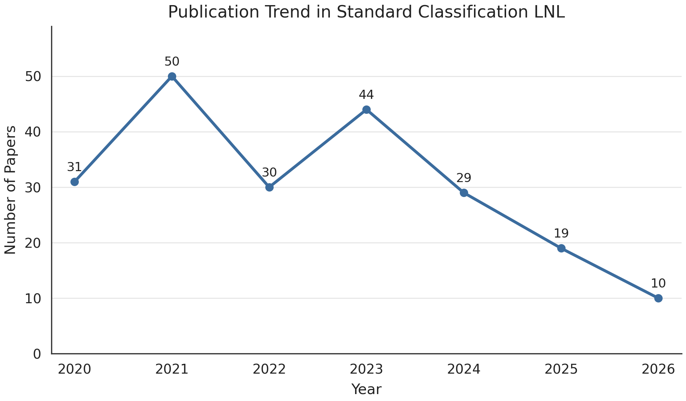
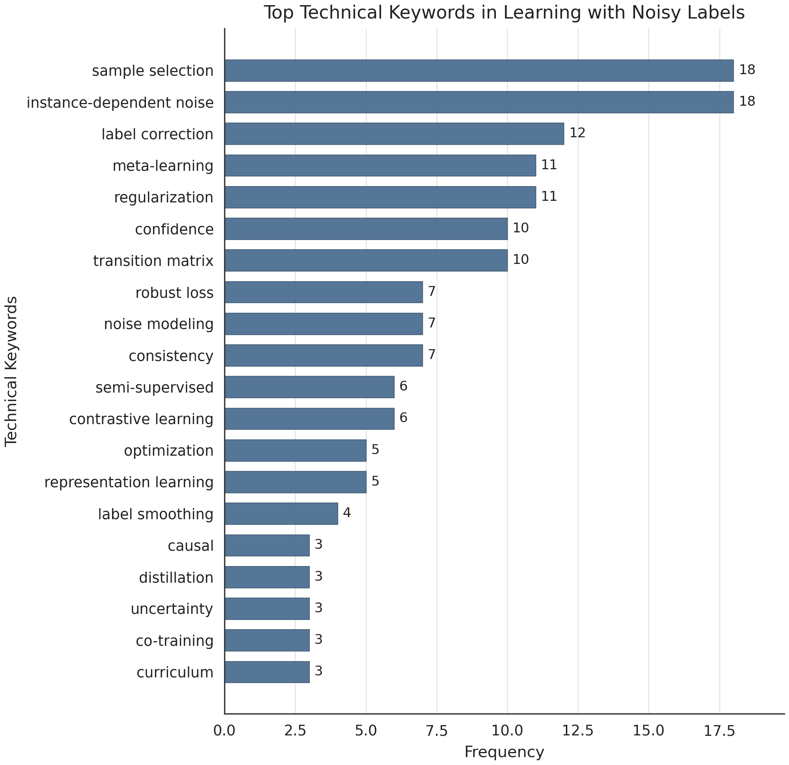
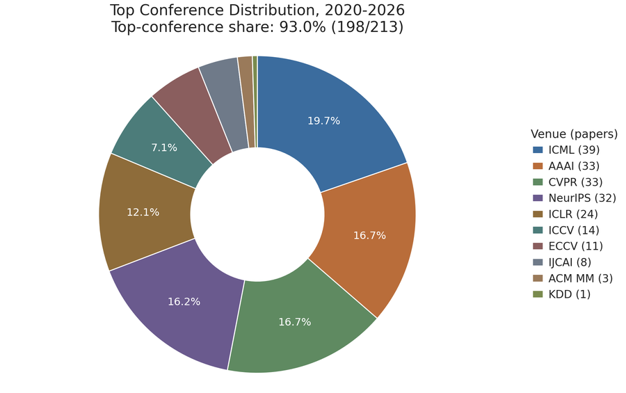
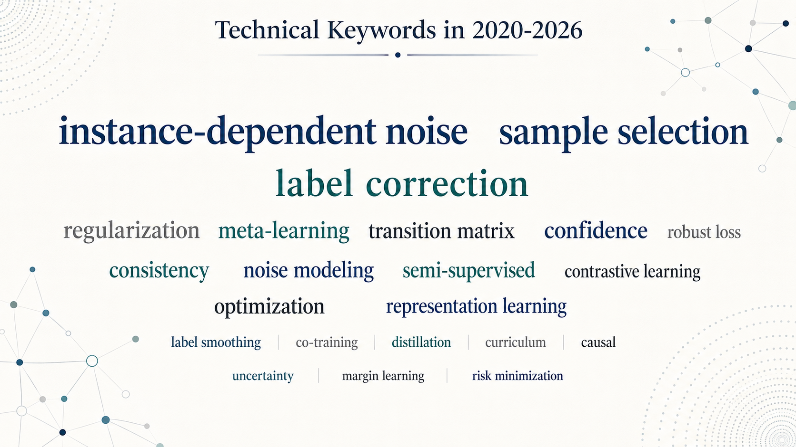

# Advances in Label Noise Learning for Standard Classification

A curated list of papers tagged as Classification LNL in the source README.

## Main Technique

## Statistical Overview

| Publication Trend | Technical Keywords |
| --- | --- |
|  Publication trend by year. |  Top technical keywords in Classification LNL. |
|  Top conference distribution from 2020 to 2026. |  Technical keyword word cloud for 2020-2026. |

## Content

- [Papers & Code in 2026](#papers--code-in-2026)
  - [ICLR 2026](#iclr-2026)
  - [CVPR 2026](#cvpr-2026)
  - [AAAI 2026](#aaai-2026)
  - [Top Journals 2026](#top-journals-2026)
- [Papers & Code in 2025](#papers--code-in-2025)
  - [NeurIPS 2025](#neurips-2025)
  - [ICML 2025](#icml-2025)
  - [CVPR 2025](#cvpr-2025)
  - [ICCV 2025](#iccv-2025)
  - [AAAI 2025](#aaai-2025)
  - [Top Journals 2025](#top-journals-2025)
- [Papers & Code in 2024](#papers--code-in-2024)
  - [Neurips 2024](#neurips-2024)
  - [ICML 2024](#icml-2024)
  - [ICLR 2024](#iclr-2024)
  - [CVPR 2024](#cvpr-2024)
  - [ECCV 2024](#eccv-2024)
  - [AAAI 2024](#aaai-2024)
  - [IJCAI 2024](#ijcai-2024)
  - [ACM MM 2024](#acm-mm-2024)
  - [Top Journals 2024](#top-journals-2024)
- [Papers & Code in 2023](#papers--code-in-2023)
  - [NeurIPS 2023](#neurips-2023)
  - [ICML 2023](#icml-2023)
  - [ICLR 2023](#iclr-2023)
  - [CVPR 2023](#cvpr-2023)
  - [ICCV 2023](#iccv-2023)
  - [AAAI 2023](#aaai-2023)
  - [IJCAI 2023](#ijcai-2023)
  - [Top Journals 2023](#top-journals-2023)
- [Papers & Code in 2022](#papers--code-in-2022)
  - [NeurIPS 2022](#neurips-2022)
  - [ICML 2022](#icml-2022)
  - [ICLR 2022](#iclr-2022)
  - [CVPR 2022](#cvpr-2022)
  - [ECCV 2022](#eccv-2022)
  - [AAAI 2022](#aaai-2022)
  - [IJCAI 2022](#ijcai-2022)
  - [ArXiv 2022](#arxiv-2022)
  - [Top Journals 2022](#top-journals-2022)
- [Papers & Code in 2021](#papers--code-in-2021)
  - [NeurIPS 2021](#neurips-2021)
  - [ICML 2021](#icml-2021)
  - [ICLR 2021](#iclr-2021)
  - [CVPR 2021](#cvpr-2021)
  - [ICCV 2021](#iccv-2021)
  - [AAAI 2021](#aaai-2021)
  - [IJCAI 2021](#ijcai-2021)
  - [KDD 2021](#kdd-2021)
  - [ACM MM 2021](#acm-mm-2021)
  - [ArXiv 2021](#arxiv-2021)
  - [Other Conferences 2021](#other-conferences-2021)
- [Papers & Code in 2020](#papers--code-in-2020)
  - [NIPS 2020](#nips-2020)
  - [ICML 2020](#icml-2020)
  - [ICLR 2020](#iclr-2020)
  - [CVPR 2020](#cvpr-2020)
  - [ECCV 2020](#eccv-2020)
  - [AAAI 2020](#aaai-2020)
  - [IJCAI 2020](#ijcai-2020)
  - [ArXiv 2020](#arxiv-2020)

## Papers & Code in 2026

### ICLR 2026

*  **[P001]** Enhancing Learning with Noisy Labels via Rockafellian Relaxation.
  
  [[Paper]](https://openreview.net/forum?id=g4EpGiN5X3)

*  **[P002]** TrainRef: Curating Data with Label Distribution and Minimal Reference for Accurate Prediction and Reliable Confidence.
  
  
  [[Paper]](https://openreview.net/forum?id=jSs8CDsF0A)

*  **[P003]** Resurfacing the Instance-only Dependent Label Noise Model through Loss Correction.
  
  
  
  [[Paper]](https://openreview.net/forum?id=tuvkrivvbG)

### CVPR 2026

*  **[P004]** Deconstructing the Failure of Ideal Noise Correction: A Three-Pillar Diagnosis.
  
  
  [[Paper]](https://arxiv.org/abs/2603.12997)

*  **[P005]** Debiased Sample Selection for Learning with Noisy Labels.
  
  [[Paper]](https://www.eric-weiwei.com/)

### AAAI 2026

*  **[P006]** Leveraging Dissimilarity Invariance as a Robust Anchor for Learning with Noisy Labels.
  
  
  [[Paper]](https://ojs.aaai.org/index.php/AAAI/article/view/37381)

*  **[P007]** On the Learning Dynamics of Two-layer Linear Networks with Label Noise SGD.
  
  
  [[Paper]](https://arxiv.org/abs/2603.10397)

*  **[P008]** Is the Information Bottleneck Robust Enough? Towards Label-Noise Resistant Information Bottleneck Learning.
  
  
  [[Paper]](https://arxiv.org/abs/2512.10573)

### Top Journals 2026

*  **[P009]** Continuous Review and Timely Correction: Enhancing the Resistance to Noisy Labels via Self-Not-True and Class-Wise Distillation. (Published on TPAMI)
  
  [[Paper]](https://doi.org/10.1109/TPAMI.2025.3649111)

*  **[P010]** Affinity-aware Uncertainty Quantification for Learning with Noisy Labels. (Published on Pattern Recognition)
  
  [[Paper]](https://www.sciencedirect.com/science/article/pii/S0031320325011586)

## Papers & Code in 2025

### NeurIPS 2025

*  **[P011]** Learning to Clean: Reinforcement Learning for Noisy Label Correction.
  
  [[Paper]](https://nips.cc/virtual/2025/poster/115438)

*  **[P012]** Enhancing Sample Selection Against Label Noise by Cutting Mislabeled Easy Examples.
  
  [[Paper]](https://neurips.cc/virtual/2025/poster/118281)

*  **[P013]** Handling Label Noise via Instance-Level Difficulty Modeling and Dynamic Optimization.
  
  [[Paper]](https://nips.cc/virtual/2025/poster/116524)[[Code]](https://github.com/iTheresaApocalypse/IDO)

### ICML 2025

*  **[P014]** On the Role of Label Noise in the Feature Learning Process.
  
  
  [[Paper]](https://proceedings.mlr.press/v267/han25c.html)

### CVPR 2025

*  **[P015]** [[**Sxu**]](https://github.com/SenyuHou) Directional Label Diffusion Model for Learning from Noisy Labels.
  
  [[Paper]](https://openaccess.thecvf.com/content/CVPR2025/html/Hou_Directional_Label_Diffusion_Model_for_Learning_from_Noisy_Labels_CVPR_2025_paper.html)[[Code]](https://github.com/SenyuHou/DLD)

### ICCV 2025

*  **[P016]** CA2C: A Prior-Knowledge-Free Approach for Robust Label Noise Learning via Asymmetric Co-learning and Co-training.
  
  
  [[Paper]](https://openaccess.thecvf.com/content/ICCV2025/html/Sheng_CA2C_A_Prior-Knowledge-Free_Approach_for_Robust_Label_Noise_Learning_via_ICCV_2025_paper.html)

*  **[P017]** Meta-Learning Dynamic Center Distance: Hard Sample Mining for Learning with Noisy Labels.
  
  
  [[Paper]](https://openaccess.thecvf.com/content/ICCV2025/html/Mu_Meta-Learning_Dynamic_Center_Distance_Hard_Sample_Mining_for_Learning_with_ICCV_2025_paper.html)

*  **[P018]** Joint Asymmetric Loss for Learning with Noisy Labels.
  
  
  [[Paper]](https://openaccess.thecvf.com/content/ICCV2025/html/Wang_Joint_Asymmetric_Loss_for_Learning_with_Noisy_Labels_ICCV_2025_paper.html)[[Code]](https://github.com/cswjl/joint-asymmetric-loss)

### AAAI 2025

*  **[P019]** Combating Semantic Contamination in Learning with Label Noise.
  
  
  [[Paper]](https://ojs.aaai.org/index.php/AAAI/article/view/32293)

*  **[P020]** Enhancing Noise-Robust Losses for Large-Scale Noisy Data Learning.
  
  [[Paper]](https://ojs.aaai.org/index.php/AAAI/article/view/32752)

*  **[P021]** SAP: Corrective Machine Unlearning with Scaled Activation Projection for Label Noise Robustness.
  
  
  
  [[Paper]](https://ojs.aaai.org/index.php/AAAI/article/view/33972)

*  **[P022]** Learning Causal Transition Matrix for Instance-dependent Label Noise.
  
  [[Paper]](https://arxiv.org/abs/2412.13516)

*  **[P023]** Label Noise Correction via Fuzzy Learning Machine.
  
  
  [[Paper]](https://ojs.aaai.org/index.php/AAAI/article/view/34055)

*  **[P024]** Enhanced Sample Selection with Confidence Tracking: Identifying Correctly Labeled Yet Hard-to-Learn Samples in Noisy Data.
  
  
  [[Paper]](https://arxiv.org/abs/2504.17474)

*  **[P025]** Noisy Label Calibration for Multi-View Classification.
  
  [[Paper]](https://ojs.aaai.org/index.php/AAAI/article/view/35485/37640)

*  **[P026]** Revisiting Interpolation for Noisy Label Correction.
  
  
  [[Paper]](https://ojs.aaai.org/index.php/AAAI/article/view/35489)

*  **[P027]** Learning from Noisy Labels via Self-Taught On-the-Fly Meta Loss Rescaling.
  
  [[Paper]](https://arxiv.org/abs/2412.12955)

### Top Journals 2025

*  **[P028]** SplitNet: Learnable Clean-Noisy Label Splitting for Learning with Noisy Labels. (Published on IJCV)
  
  [[Paper]](https://link.springer.com/article/10.1007/s11263-024-02187-4)

*  **[P029]** Improving the Instance-Dependent Transition Matrix Estimation by Exploiting Self-Supervised Learning. (Published on TPAMI)
  
  [[Paper]](https://doi.org/10.1109/TPAMI.2025.3595613)

## Papers & Code in 2024

### Neurips 2024

*  **[P030]** Learning the Latent Causal Structure for Modeling Label Noise.
  
  [[Paper]](https://nips.cc/virtual/2024/poster/93700)

*  **[P031]** Learning from Noisy Labels via Conditional Distributionally Robust Optimization.
  
  [[Paper]](https://nips.cc/virtual/2024/poster/96820)

*  **[P032]** Label Noise: Ignorance Is Bliss.
  
  
  [[Paper]](https://nips.cc/virtual/2024/poster/94205)

### ICML 2024

*  **[P033]** Pi-DUAL: Using privileged information to distinguish clean from noisy labels.
  
  [[Paper]](https://proceedings.mlr.press/v235/wang24bb.html)

*  **[P034]** Self-cognitive Denoising in the Presence of Multiple Noisy Label Sources.
  
  [[Paper]](https://proceedings.mlr.press/v235/sun24o.html)

*  **[P035]** (KDD 2025) CLID-MU: Cross-Layer Information Divergence Based Meta Update Strategy for Learning with Noisy Labels.
  
  
  [[Paper]](https://doi.org/10.1145/3711896.3736880)

*  **[P036]** (IJCAI 2025) COLUR: Confidence-Oriented Learning, Unlearning and Relearning with Noisy-Label Data for Model Restoration and Refinement.
  
  
  [[Paper]](https://www.ijcai.org/proceedings/2025/1038)

### ICLR 2024

*  **[P037]** Understanding and Mitigating the Label Noise in Pre-training on Downstream Tasks.
  
  
  [[Paper]](https://openreview.net/forum?id=TjhUtloBZU)

*  **[P038]** Early Stopping Against Label Noise Without Validation Data.
  
  [[Paper]](https://openreview.net/forum?id=CMzF2aOfqp)

*  **[P039]** Why is SAM Robust to Label Noise?
  
  
  [[Paper]](https://openreview.net/forum?id=3aZCPl3ZvR)

*  **[P040]** Dirichlet-based Per-Sample Weighting by Transition Matrix for Noisy Label Learning.
  
  
  [[Paper]](https://openreview.net/forum?id=A4mJuFRMN8)

### CVPR 2024

*  **[P041]** Estimating Noisy Class Posterior with Part-level Labels for Noisy Label Learning.
  
  [[Paper]](https://openaccess.thecvf.com/content/CVPR2024/html/Zhao_Estimating_Noisy_Class_Posterior_with_Part-level_Labels_for_Noisy_Label_CVPR_2024_paper.html)

*  **[P042]** Learning with Structural Labels for Learning with Noisy Labels.
  
  [[Paper]](https://openaccess.thecvf.com/content/CVPR2024/html/Kim_Learning_with_Structural_Labels_for_Learning_with_Noisy_Labels_CVPR_2024_paper.html)

*  **[P043]** L2B: Learning to Bootstrap Robust Models for Combating Label Noise.
  
  
  [[Paper]](https://openaccess.thecvf.com/content/CVPR2024/html/Zhou_L2B_Learning_to_Bootstrap_Robust_Models_for_Combating_Label_Noise_CVPR_2024_paper.html)

### ECCV 2024

*  **[P044]** Foster Adaptivity and Balance in Learning with Noisy Labels.
  
  [[Paper]](https://www.ecva.net/papers/eccv_2024/papers_ECCV/html/3908_ECCV_2024_paper.php)

*  **[P045]** LNL+K: Enhancing Learning with Noisy Labels Through Noise Source Knowledge Integration.
  
  [[Paper]](https://www.ecva.net/papers/eccv_2024/papers_ECCV/html/7862_ECCV_2024_paper.php)

*  **[P046]** MTaDCS: Moving Trace and Feature Density-based Confidence Sample Selection under Label Noise.
  
  
  [[Paper]](https://www.ecva.net/papers/eccv_2024/papers_ECCV/html/8968_ECCV_2024_paper.php)

### AAAI 2024

*  **[P047]** [[**Sxu**]](https://github.com/SenyuHou) Which Is More Effective in Label Noise Cleaning, Correction or Filtering?
  
  
  [[Paper]](https://ojs.aaai.org/index.php/AAAI/article/view/29183/30238)

*  **[P048]** Tackling Instance-Dependent Label Noise with Class Rebalance and Geometric Regularization.
  
  
  
  [[Paper]](https://doi.org/10.1145/3637528.3671707)

*  **[P049]** Regroup Median Loss for Combating Label Noise.
  
  [[Paper]](https://ojs.aaai.org/index.php/AAAI/article/view/29250)

*  **[P050]** Mitigating Label Noise through Data Ambiguation.
  
  
  [[Paper]](https://ojs.aaai.org/index.php/AAAI/article/view/29286)

*  **[P051]** Learning with Noisy Labels Using Hyperspherical Margin Weighting.
  
  
  [[Paper]](https://ojs.aaai.org/index.php/AAAI/article/view/29626)

*  **[P052]** Dirichlet-Based Prediction Calibration for Learning with Noisy Labels.
  
  
  [[Paper]](https://ojs.aaai.org/index.php/AAAI/article/view/29672)

### IJCAI 2024

*  **[P053]** Fine-tuning Pre-trained Models for Robustness under Noisy Labels.
  
  
  [[Paper]](https://www.ijcai.org/proceedings/2024/403)

### ACM MM 2024

*  **[P054]** Enhancing Robustness in Learning with Noisy Labels: An Asymmetric Co-Training Approach.
  
  
  [[Paper]](https://doi.org/10.1145/3664647.3680924)

*  **[P055]** Mitigate Catastrophic Remembering via Continual Knowledge Purification for Noisy Label Learning.
  
  [[Paper]](https://doi.org/10.1145/3664647.3680975)

### Top Journals 2024

*  **[P056]** Tackling Noisy Labels with Network Parameter Additive Decomposition. (Published on TPAMI)
  
  [[Paper]](https://doi.org/10.1109/TPAMI.2024.3367129)

*  **[P057]** A Time-Consistency Curriculum for Learning from Instance-Dependent Noisy Labels. (Published on TPAMI)
  
  
  
  [[Paper]](https://doi.org/10.1109/TPAMI.2024.3433918)

*  **[P058]** BadLabel: A Robust Perspective on Evaluating and Enhancing Label-noise Learning. (Published on TPAMI)
  
  
  [[Paper]](https://doi.org/10.1109/TPAMI.2024.3439233)

## Papers & Code in 2023

### NeurIPS 2023

*  **[P059]** Robust Data Pruning under Label Noise via Maximizing Re-labeling Accuracy.
  
  
  [[Paper]](https://openreview.net/forum?id=xWCp0uLcpG)

*  **[P060]** Subclass-Dominant Label Noise: A Counterexample for the Success of Early Stopping.
  
  
  [[Paper]](https://openreview.net/forum?id=kR21XsZeAr)[[Code]](https://github.com/tmllab/2023_NeurIPS_SDN)

*  **[P061]** Active Negative Loss Functions for Learning with Noisy Labels.
  
  [[Paper]](https://neurips.cc/virtual/2023/poster/71501)[[Code]](https://github.com/Virusdoll/Active-Negative-Loss)

*  **[P062]** Training shallow ReLU networks on noisy data using hinge loss: when do we overfit and is it benign?
  
  
  [[Paper]](https://arxiv.org/abs/2306.09955)

*  **[P063]** CSOT: Curriculum and Structure-Aware Optimal Transport for Learning with Noisy Labels.
  
  [[Paper]](https://openreview.net/forum?id=y50AnAbKp1)[[Code]](https://github.com/changwxx/CSOT-for-LNL)

*  **[P064]** Label Poisoning is All You Need.
  
  
  [[Paper]](https://arxiv.org/abs/2310.18933)[[Code]](https://github.com/SewoongLab/FLIP)

*  **[P065]** IPMix: Label-Preserving Data Augmentation Method for Training Robust Classifiers.
  
  [[Paper]](https://openreview.net/forum?id=No52399wXA)

### ICML 2023

*  **[P066]** Identifiability of Label Noise Transition Matrix.
  
  
  [[Paper]](https://proceedings.mlr.press/v202/liu23g)

*  **[P067]** Which is Better for Learning with Noisy Labels: The Semi-supervised Method or Modeling Label Noise?
  
  
  [[Paper]](https://proceedings.mlr.press/v202/yao23a)

*  **[P068]** CrossSplit: Mitigating Label Noise Memorization through Data Splitting.
  
  [[Paper]](http://proceedings.mlr.press/v202/kim23a/kim23a.pdf)[[Code]](https://github.com/SAITPublic/CrossSplit)

*  **[P069]** Understanding Self-Distillation in the Presence of Label Noise.
  
  
  
  [[Paper]](http://proceedings.mlr.press/v202/das23d/das23d.pdf)

*  **[P070]** When does Privileged information Explain Away Label Noise?
  
  
  [[Paper]](https://proceedings.mlr.press/v202/ortiz-jimenez23a)

*  **[P071]** Random Classification Noise does not defeat All Convex Potential Boosters Irrespective of Model Choice.
  
  
  [[Paper]](https://proceedings.mlr.press/v202/mansour23a.html)

*  **[P072]** Label Distributionally Robust Losses for Multi-class Classification: Consistency, Robustness and Adaptivity.
  
  
  
  
  [[Paper]](https://proceedings.mlr.press/v202/zhu23o.html)

### ICLR 2023

*  **[P073]** Mitigating Memorization of Noisy Labels via Regularization between Representations.
  
  
  [[Paper \& Code]](https://openreview.net/forum?id=6qcYDVlVLnK)

*  **[P074]** On the Edge of Benign Overfitting: Label Noise and Overparameterization Level.
  
  
  [[Paper \& Code]](https://openreview.net/forum?id=UrEwJebCxk)

*  **[P075]** Memorization-Dilation: Modeling Neural Collapse Under Noise.
  
  [[Paper \& Code]](https://openreview.net/forum?id=cJWxqmmDL2b)

*  **[P076]** Quantifying and Mitigating the Impact of Label Errors on Model Disparity Metrics.
  
  
  [[Paper \& Code]](https://openreview.net/forum?id=RUzSobdYy0V)

*  **[P077]** A law of adversarial risk, interpolation, and label noise.
  
  
  [[Paper \& Code]](https://openreview.net/forum?id=0_TxFpAsEI)

*  **[P078]** MCAL: Minimum Cost Human-Machine Active Labeling.
  
  [[Paper \& Code]](https://openreview.net/forum?id=1FxRPKrH8bw)

### CVPR 2023

*  **[P079]** Twin Contrastive Learning with Noisy Labels.
  
  [[Paper]](https://arxiv.org/abs/2303.06930)[[Code]](https://github.com/Hzzone/TCL)

*  **[P080]** Learning from Noisy Labels with Decoupled Meta Label Purifier.
  
  
  [[Paper]](https://arxiv.org/abs/2302.06810)[[Code]](https://github.com/yuanpengtu/DMLP)

*  **[P081]** DISC: Learning from Noisy Labels via Dynamic Instance-Specific Selection and Correction.
  
  
  [[Paper]](https://openaccess.thecvf.com/content/CVPR2023/papers/Li_DISC_Learning_From_Noisy_Labels_via_Dynamic_Instance-Specific_Selection_and_CVPR_2023_paper.pdf)[[Code]](https://github.com/jackyfl/disc)

*  **[P082]** Fine-Grained Classification with Noisy Labels.
  
  [[Paper]](https://openaccess.thecvf.com/content/CVPR2023/papers/Wei_Fine-Grained_Classification_With_Noisy_Labels_CVPR_2023_paper.pdf)

*  **[P083]** OT-Filter: An Optimal Transport Filter for Learning With Noisy Labels.
  
  [[Paper]](https://openaccess.thecvf.com/content/CVPR2023/papers/Feng_OT-Filter_An_Optimal_Transport_Filter_for_Learning_With_Noisy_Labels_CVPR_2023_paper.pdf)

*  **[P084]** How To Prevent the Continuous Damage of Noises To Model Training?
  
  
  [[Paper]](https://openaccess.thecvf.com/content/CVPR2023/html/Yu_How_To_Prevent_the_Continuous_Damage_of_Noises_To_Model_CVPR_2023_paper.html)

### ICCV 2023

*  **[P085]** PADDLES: Phase-Amplitude Spectrum Disentangled Early Stopping for Learning with Noisy Labels.
  
  [[Paper]](https://openaccess.thecvf.com/content/ICCV2023/papers/Huang_PADDLES_Phase-Amplitude_Spectrum_Disentangled_Early_Stopping_for_Learning_with_Noisy_ICCV_2023_paper.pdf)[[Code]](https://github.com/CoderHHX/PADDLES)

*  **[P086]** Sample-wise Label Confidence Incorporation for Learning with Noisy Labels.
  
  [[Paper]](https://openaccess.thecvf.com/content/ICCV2023/papers/Ahn_Sample-wise_Label_Confidence_Incorporation_for_Learning_with_Noisy_Labels_ICCV_2023_paper.pdf)

*  **[P087]** LA-Net: Landmark-Aware Learning for Reliable Facial Expression Recognition under Label Noise.
  
  [[Paper]](https://openaccess.thecvf.com/content/ICCV2023/papers/Wu_LA-Net_Landmark-Aware_Learning_for_Reliable_Facial_Expression_Recognition_under_Label_ICCV_2023_paper.pdf)

*  **[P088]** Combating Noisy Labels with Sample Selection by Mining High-Discrepancy Examples.
  
  [[Paper]](https://openaccess.thecvf.com/content/ICCV2023/papers/Xia_Combating_Noisy_Labels_with_Sample_Selection_by_Mining_High-Discrepancy_Examples_ICCV_2023_paper.pdf)[[Code]](https://github.com/xiaoboxia/CoDis)

*  **[P089]** RankMatch: Fostering Confidence and Consistency in Learning with Noisy Labels.
  
  
  [[Paper]](https://openaccess.thecvf.com/content/ICCV2023/papers/Zhang_RankMatch_Fostering_Confidence_and_Consistency_in_Learning_with_Noisy_Labels_ICCV_2023_paper.pdf)

*  **[P090]** Late Stopping: Avoiding Confidently Learning from Mislabeled Examples.
  
  [[Paper]](https://openaccess.thecvf.com/content/ICCV2023/html/Yuan_Late_Stopping_Avoiding_Confidently_Learning_from_Mislabeled_Examples_ICCV_2023_paper.html)

*  **[P091]** Enhanced Meta Label Correction for Coping with Label Corruption.
  
  
  [[Paper]](https://openaccess.thecvf.com/content/ICCV2023/html/Taraday_Enhanced_Meta_Label_Correction_for_Coping_with_Label_Corruption_ICCV_2023_paper.html)

### AAAI 2023

*  **[P092]** Class-Independent Regularization for Learning with Noisy Labels.
  
  [[Paper]](https://ojs.aaai.org/index.php/AAAI/article/view/25434)

*  **[P093]** A Gift from Label Smoothing: Robust Training with Adaptive Label Smoothing via Auxiliary Classifier under Label Noise.
  
  
  [[Paper]](https://ojs.aaai.org/index.php/AAAI/article/view/26004)

*  **[P094]** Learning from Training Dynamics: Identifying Mislabeled Data beyond Manually Designed Features.
  
  
  [[Paper]](https://ojs.aaai.org/index.php/AAAI/article/view/25972)

*  **[P095]** USDNL: Uncertainty-Based Single Dropout in Noisy Label Learning.
  
  [[Paper]](https://ojs.aaai.org/index.php/AAAI/article/view/26264)

*  **[P096]** Two Wrongs Don't Make a Right: Combating Confirmation Bias in Learning with Label Noise.
  
  [[Paper]](https://ojs.aaai.org/index.php/AAAI/article/view/26725)

*  **[P097]** Rethinking Label Refurbishment: Model Robustness under Label Noise.
  
  
  [[Paper]](https://ojs.aaai.org/index.php/AAAI/article/view/26751)

### IJCAI 2023

*  **[P098]** MILD: Modeling the Instance Learning Dynamics for Learning with Noisy Labels.
  
  
  [[Paper]](https://www.ijcai.org/proceedings/2023/92)

*  **[P099]** ProMix: Combating Label Noise via Maximizing Clean Sample Utility.
  
  
  [[Paper]](https://www.ijcai.org/proceedings/2023/494)

### Top Journals 2023

*  **[P100]** A Parametrical Model for Instance-Dependent Label Noise. (Published on TPAMI)
  
  
  [[Paper]](https://doi.org/10.1109/TPAMI.2023.3301876)

*  **[P101]** Regularly Truncated M-Estimators for Learning With Noisy Labels. (Published on TPAMI)
  
  [[Paper]](https://doi.org/10.1109/TPAMI.2023.3347850)

*  **[P102]** Learning to Learn From Noisy Labeled Data. (Published on TKDE)
  
  [[Paper]](https://doi.org/10.1109/TKDE.2023.3271677)

## Papers & Code in 2022

### NeurIPS 2022

*  **[P103]** Class-Dependent Label-Noise Learning with Cycle-Consistency Regularization.
  
  
  [[Paper & Code]](https://openreview.net/forum?id=IvnoGKQuXi)

*  **[P104]** Robustness to Label Noise Depends on the Shape of the Noise Distribution.
  
  
  [[Paper & Code]](https://openreview.net/forum?id=AlpR6dzKjfy)

*  **[P105]** Noise Attention Learning: Enhancing Noise Robustness by Gradient Scaling.
  
  
  [[Paper]](https://proceedings.neurips.cc/paper_files/paper/2022/hash/92864e1191ed272deb0914b3bb50f97c-Abstract-Conference.html)

*  **[P106]** Confidence-based Reliable Learning under Dual Noises.
  
  
  [[Paper]](https://proceedings.neurips.cc/paper_files/paper/2022/hash/e444859b2a22df6b56af9381ad1e9480-Abstract-Conference.html)

### ICML 2022

*  **[P107]** To Smooth or Not? When Label Smoothing Meets Noisy Labels.
  
  [[Paper]](https://arxiv.org/abs/2106.04149)[[Code]](https://github.com/UCSC-REAL/negative-label-smoothing)

*  **[P108]** Detecting Corrupted Labels Without Training a Model to Predict.
  
  
  [[Paper]](https://arxiv.org/abs/2110.06283)[[Code]](https://github.com/UCSC-REAL/SimiFeat)

*  **[P109]** Beyond Images: Label Noise Transition Matrix Estimation for Tasks with Lower-Quality Features.
  
  
  [[Paper]](https://arxiv.org/abs/2202.01273)

*  **[P110]** Robust Training under Label Noise by Over-parameterization.
  
  
  [[Paper]](https://arxiv.org/abs/2202.14026)[[Code]](https://github.com/shengliu66/SOP)

*  **[P111]** Estimating Instance-dependent Bayes-label Transition Matrix using a Deep Neural Network.
  
  [[Paper]](https://proceedings.mlr.press/v162/yang22p.html)

*  **[P112]** Guaranteed Robust Deep Learning against Extreme Label Noise using Self-supervised Learning.
  
  

*  **[P113]** Robust Meta-learning with Sampling Noise and Label Noise via Eigen-Reptile.
  
  [[Paper]](https://arxiv.org/pdf/2206.01944v1.pdf)[[Code]](https://github.com/anfeather/eigen-reptile)

*  **[P114]** Guaranteed Robust Deep Learning against Extreme Label Noise using Self-supervised Learning.
  
  

*  **[P115]** Transfer and Marginalize: Explaining Away Label Noise with Privileged Information.
  
  
  [[Paper]](https://proceedings.mlr.press/v162/collier22a.html)

---

### ICLR 2022

*  **[P116]** Resolving Training Biases via Influence-based Data Relabeling.
  
  [[Paper and Code]](https://openreview.net/forum?id=EskfH0bwNVn)

*  **[P117]** Sample Selection with Uncertainty of Losses for Learning with Noisy Labels.
  
  
  [[Paper and Code]](https://openreview.net/forum?id=xENf4QUL4LW)

*  **[P118]** An Information Fusion Approach to Learning with Instance-Dependent Label Noise.
  
  [[Paper and Code]](https://openreview.net/forum?id=ecH2FKaARUp)

### CVPR 2022

*  **[P119]** Selective-Supervised Contrastive Learning with Noisy Labels.
  
  
  [[Paper]](https://arxiv.org/abs/2203.04181)[[Code]](https://github.com/ShikunLi/Sel-CL)

*  **[P120]** Noise Is Also Useful: Negative Correlation-Steered Latent Contrastive Learning.
  
  [[Paper]](https://openaccess.thecvf.com/content/CVPR2022/html/Yan_Noise_Is_Also_Useful_Negative_Correlation-Steered_Latent_Contrastive_Learning_CVPR_2022_paper.html)

*  **[P121]** PNP: Robust Learning From Noisy Labels by Probabilistic Noise Prediction.
  
  
  [[Paper]](https://openaccess.thecvf.com/content/CVPR2022/html/Sun_PNP_Robust_Learning_From_Noisy_Labels_by_Probabilistic_Noise_Prediction_CVPR_2022_paper.html)

*  **[P122]** UniCon: Combating Label Noise Through Uniform Selection and Contrastive Learning.
  
  
  [[Paper]](https://openaccess.thecvf.com/content/CVPR2022/html/Karim_UniCon_Combating_Label_Noise_Through_Uniform_Selection_and_Contrastive_Learning_CVPR_2022_paper.html)

*  **[P123]** Instance-Dependent Label-Noise Learning With Manifold-Regularized Transition Matrix Estimation.
  
  [[Paper]](https://openaccess.thecvf.com/content/CVPR2022/html/Cheng_Instance-Dependent_Label-Noise_Learning_With_Manifold-Regularized_Transition_Matrix_Estimation_CVPR_2022_paper.html)

### ECCV 2022

*  **[P124]** Teaching with Soft Label Smoothing for Mitigating Noisy Labels in Facial Expressions.
  
  [[Paper]](https://www.ecva.net/papers/eccv_2022/papers_ECCV/papers/136720639.pdf)[[Code]](https://github.com/toharl/soft)

*  **[P125]** Learn From All: Erasing Attention Consistency for Noisy Label Facial Expression Recognition.
  
  
  [[Paper]](https://arxiv.org/abs/2207.10299)[[Code]](https://github.com/zyh-uaiaaaa/Erasing-Attention-Consistency)

*  **[P126]** Centrality and Consistency: Two-Stage Clean Samples Identification for Learning with Instance-Dependent Noisy Labels.
  
  
  
  [[Paper]](https://arxiv.org/abs/2207.14476)[[Code]](https://github.com/uitrbn/TSCSI_IDN)

*  **[P127]** Learning with Noisy Labels by Efficient Transition Matrix Estimation to Combat Label Miscorrection.
  
  
  [[Paper]](https://arxiv.org/abs/2111.14932)[[Code]](https://github.com/hyperconnect/FasTEN)

*  **[P128]** Self-Filtering: A Noise-Aware Sample Selection for Label Noise with Confidence Penalization.
  
  [[Paper]](https://arxiv.org/abs/2208.11351)

*  **[P129]** Active label correction using robust parameter update and entropy propagation.
  
  [[Paper]](https://www.ecva.net/papers/eccv_2022/papers_ECCV/papers/136810001.pdf)

### AAAI 2022

*  **[P130]** Noise-Robust Learning from Multiple Unsupervised Sources of Inferred Labels.
  
  [[Paper]](https://ojs.aaai.org/index.php/AAAI/article/view/20806)

### IJCAI 2022

*  **[P131]** SELC: Self-Ensemble Label Correction Improves Learning with Noisy Labels.
  
  
  [[Paper]](https://www.ijcai.org/proceedings/2022/455)

### ArXiv 2022

*  **[P132]** Constrained Instance and Class Reweighting for Robust Learning under Label Noise.
  
  [[Paper]](https://arxiv.org/abs/2111.05428)

*  **[P133]** Do We Need to Penalize Variance of Losses for Learning with Label Noise?.
  
  
  [[Paper]](https://arxiv.org/abs/2201.12739)

*  **[P134]** On Learning Contrastive Representations for Learning with Noisy Labels.
  
  [[Paper]](https://arxiv.org/abs/2203.01785)

*  **[P135]** Benign Overfitting without Linearity: Neural Network Classifiers Trained by Gradient Descent for Noisy Linear Data.
  
  
  [[Paper]](https://arxiv.org/abs/2202.05928#:~:text=11%20Feb%202022%5D-,Benign%20Overfitting%20without%20Linearity%3A%20Neural%20Network%20Classifiers%20Trained%20by,Descent%20for%20Noisy%20Linear%20Data&text=Abstract%3A%20Benign%20overfitting%2C%20the%20phenomenon,models%20trained%20with%20gradient%20descent.)

*  **[P136]** Convolutional Network Fabric Pruning With Label Noise.
  
  [[Paper]](https://arxiv.org/abs/2202.07268)

*  **[P137]** Learning with Neighbor Consistency for Noisy Labels.
  
  
  [[Paper]](https://arxiv.org/abs/2202.02200)

*  **[P138]** Investigating Why Contrastive Learning Benefits Robustness Against Label Noise.
  
  
  [[Paper]](https://arxiv.org/abs/2201.12498)

*  **[P139]** GMM Discriminant Analysis with Noisy Label for Each Class.
  
  
  [[Paper]](https://arxiv.org/abs/2201.10242)

---

### Top Journals 2022

*  **[P140]** Wasserstein Adversarial Regularization for Learning with Label Noise. (Published on TPAMI)
  
  [[Paper]](https://doi.org/10.1109/TPAMI.2022.3156685)

## Papers & Code in 2021

### NeurIPS 2021

*  **[P141]** Can Less be More? When Increasing-to-Balancing Label Noise Rates Considered Beneficial.
  
  
  [[Paper]](https://arxiv.org/abs/2107.05913#:~:text=We%20are%20primarily%20inspired%20by,fairness%20guarantees%20against%20label%20bias.)[[Code]](https://github.com/UCSC-REAL/CanLessBeMore)

*  **[P142]** Understanding and Improving Early Stopping for Learning with Noisy Labels.
  
  
  [[Paper]](https://arxiv.org/abs/2106.15853)[[Code]](https://github.com/tmllab/PES)

*  **[P143]** How does a Neural Network's Architecture Impact its Robustness to Noisy Labels?
  
  
  [[Paper]](https://openreview.net/forum?id=Ir-WwGboFN-)[[Code]](https://github.com/jinglingli/alignment_noisy_label)

*  **[P144]** FINE Samples for Learning with Noisy Labels.
  
  [[Paper]](https://arxiv.org/pdf/2102.11628v3.pdf)[[Code]](https://github.com/Kthyeon/FINE_official)

*  **[P145]** Label Noise SGD Provably Prefers Flat Global Minimizers.
  
  
  [[Paper]](https://arxiv.org/abs/2106.06530)[[Code]](https://github.com/adamian98/LabelNoiseFlatMinimizers)

*  **[P146]** Improved Regularization and Robustness for Fine-tuning in Neural Networks.
  
  [[Paper]](https://openreview.net/forum?id=QX32YlxrQJc)[[Code]](https://github.com/NEU-StatsML-Research/Regularized-Self-Labeling)

*  **[P147]** Instance-dependent Label-noise Learning under a Structural Causal Model.
  
  [[Paper]](https://arxiv.org/abs/2109.02986)

*  **[P148]** DP-SSL: Towards Robust Semi-supervised Learning with A Few Labeled Samples.
  
  [[Paper]](https://arxiv.org/abs/2110.13740)

### ICML 2021

*  **[P149]** Understanding Instance-Level Label Noise: Disparate Impacts and Treatments.
  
  
  [[Paper]](https://proceedings.mlr.press/v139/liu21a.html)

*  **[P150]** Clusterability as an Alternative to Anchor Points When Learning with Noisy Labels.
  
  [[Paper]](https://arxiv.org/pdf/2102.05291.pdf)[[Code]](https://github.com/zwzhu-d/HOC)

*  **[P151]** Learning Noise Transition Matrix from Only Noisy Labels via Total Variation Regularization.
  
  [[Paper]](https://arxiv.org/pdf/2102.02414v2.pdf)[[Code]](https://github.com/YivanZhang/lio)

*  **[P152]** Class2Simi: A Noise Reduction Perspective on Learning with Noisy Labels.
  
  [[Paper]](https://arxiv.org/abs/2006.07831)

*  **[P153]** Provably End-to-end Label-noise Learning without Anchor Points.
  
  
  [[Paper]](https://arxiv.org/pdf/2102.02400.pdf)

*  **[P154]** Asymmetric Loss Functions for Learning with Noisy Labels.
  
  
  [[Paper]](https://arxiv.org/pdf/2106.03110v1.pdf)[[Code]](https://github.com/hitcszx/ALFs)

*  **[P155]** Confidence Scores Make Instance-dependent Label-noise Learning Possible.
  
  
  [[Paper]](https://arxiv.org/abs/2001.03772)

*  **[P156]** Learning from Noisy Labels with No Change to the Training Process.
  
  [[Paper]](http://proceedings.mlr.press/v139/zhang21k/zhang21k.pdf)

### ICLR 2021

*  **[P157]** When Optimizing f-Divergence is Robust with Label Noise.
  
  [[Paper]](https://openreview.net/pdf?id=WesiCoRVQ15)[[Code]](https://github.com/weijiaheng/Robust-f-divergence-measures)

*  **[P158]** Learning with Instance-Dependent Label Noise: A Sample Sieve Approach.
  
  
  [[Paper]](https://openreview.net/pdf?id=2VXyy9mIyU3)[[Code]](https://github.com/haochenglouis/cores)

*  **[P159]** Noise against noise: stochastic label noise helps combat inherent label noise.
  
  [[Paper]](https://openreview.net/pdf?id=80FMcTSZ6J0)[[Code]](https://github.com/chenpf1025/SLN)

*  **[P160]** Learning with Feature-Dependent Label Noise: A Progressive Approach.
  
  
  [[Paper]](https://openreview.net/pdf?id=ZPa2SyGcbwh)[[Code]](https://github.com/pxiangwu/PLC)

*  **[P161]** Robust early-learning: Hindering the memorization of noisy labels.
  
  [[Paper]](https://openreview.net/pdf?id=Eql5b1_hTE4)[[Code]](https://github.com/xiaoboxia/CDR)

### CVPR 2021

*  **[P162]** A Second-Order Approach to Learning with Instance-Dependent Label Noise.
  
  [[Paper]](https://arxiv.org/abs/2012.11854)[[Code]](https://github.com/UCSC-REAL/CAL)

*  **[P163]** Multi-Objective Interpolation Training for Robustness to Label Noise.
  
  [[Paper]](https://arxiv.org/abs/2012.04462)[[Code]](https://git.io/JI40X)

*  **[P164]** Augmentation Strategies for Learning with Noisy Labels.
  
  [[Paper]](https://arxiv.org/abs/2103.02130)[[Code]](https://github.com/KentoNishi/Augmentation-for-LNL)

*  **[P165]** Jo-SRC: A Contrastive Approach for Combating Noisy Labels.
  
  [[Paper]](https://arxiv.org/pdf/2103.13029.pdf)[[Code]](https://github.com/NUST-Machine-Intelligence-Laboratory/Jo-SRC)

*  **[P166]** Partially View-aligned Representation Learning with Noise-robust Contrastive Loss.
  
  [[Paper]](https://openaccess.thecvf.com/content/CVPR2021/papers/Yang_Partially_View-Aligned_Representation_Learning_With_Noise-Robust_Contrastive_Loss_CVPR_2021_paper.pdf)[[Code]](https://github.com/XLearning-SCU/2021-CVPR-MvCLN)

*  **[P167]** Correlated Input-Dependent Label Noise in Large-Scale Image Classification.
  
  [[Paper]](https://arxiv.org/abs/2105.10305)

*  **[P168]** Faster Meta Update Strategy for Noise-Robust Deep Learning.
  
  [[Paper]](https://github.com/youjiangxu/FaMUS/tree/main/paper)[[Code]](https://github.com/youjiangxu/FaMUS)

*  **[P169]** Joint Negative and Positive Learning for Noisy Labels.
  
  [[Paper]](https://arxiv.org/abs/2104.06574)

*  **[P170]** Faster Meta Update Strategy for Noise-Robust Deep Learning.
  
  [[Paper]](https://arxiv.org/abs/2104.15092)

*  **[P171]** AutoDO: Robust AutoAugment for Biased Data with Label Noise via Scalable Probabilistic Implicit Differentiation.
  
  
  
  [[Paper]](https://arxiv.org/abs/2103.05863)[[Code]](https://github.com/gudovskiy/autodo)

*  **[P172]** ProSelfLC: Progressive Self Label Correction for Training Robust Deep Neural Networks.
  
  [[Paper]](https://openaccess.thecvf.com/content/CVPR2021/html/Wang_ProSelfLC_Progressive_Self_Label_Correction_for_Training_Robust_Deep_Neural_CVPR_2021_paper.html)

### ICCV 2021

*  **[P173]** Me-Momentum: Extracting Hard Confident Examples From Noisily Labeled Data.
  
  [[Paper]](https://openaccess.thecvf.com/content/ICCV2021/html/Bai_Me-Momentum_Extracting_Hard_Confident_Examples_From_Noisily_Labeled_Data_ICCV_2021_paper.html)

*  **[P174]** Searching for Robustness: Loss Learning for Noisy Classification Tasks.
  
  [[Paper]](https://openaccess.thecvf.com/content/ICCV2021/html/Gao_Searching_for_Robustness_Loss_Learning_for_Noisy_Classification_Tasks_ICCV_2021_paper.html)

*  **[P175]** Learning From Noisy Data With Robust Representation Learning.
  
  [[Paper]](https://openaccess.thecvf.com/content/ICCV2021/html/Li_Learning_From_Noisy_Data_With_Robust_Representation_Learning_ICCV_2021_paper.html)

*  **[P176]** Switchable K-Class Hyperplanes for Noise-Robust Representation Learning.
  
  [[Paper]](https://openaccess.thecvf.com/content/ICCV2021/html/Liu_Switchable_K-Class_Hyperplanes_for_Noise-Robust_Representation_Learning_ICCV_2021_paper.html)

### AAAI 2021

*  **[P177]** Beyond Class-Conditional Assumption: A Primary Attempt to Combat Instance-Dependent Label Noise.
  
  [[Paper]](https://arxiv.org/abs/2012.05458)[[Code]](https://github.com/chenpf1025/IDN)

*  **[P178]** Learning to Purify Noisy Labels via Meta Soft Label Corrector.
  
  
  [[Paper]](https://arxiv.org/abs/2008.00627)[[Code]](https://github.com/WuYichen-97/Learning-to-Purify-Noisy-Labels-via-Meta-Soft-Label-Corrector)

*  **[P179]** Robustness of Accuracy Metric and its Inspirations in Learning with Noisy Labels.
  
  
  [[Paper]](https://arxiv.org/abs/2012.04193)[[Code]](https://github.com/chenpf1025/RobustnessAccuracy)

*  **[P180]** Learning from Noisy Labels with Complementary Loss Functions.
  
  [[Paper]](http://palm.seu.edu.cn/zhangml/files/AAAI'21a.pdf)[[Code]](https://github.com/dengbaowang/CompLossForNoisyLabels)

*  **[P181]** Tackling Instance-Dependent Label Noise via a Universal Probabilistic Model.
  
  [[Paper]](https://niug1984.github.io/paper/wang_aaai21.pdf)

*  **[P182]** Learning with Group Noise.
  
  [[Paper]](https://gcatnjust.github.io/ChenGong/paper/wang_aaai21_2.pdf)

*  **[P183]** Meta Label Correction for Noisy Label Learning.
  
  
  [[Paper]](https://www.microsoft.com/en-us/research/publication/meta-label-correction-for-noisy-label-learning/)

---

---

### IJCAI 2021

*  **[P184]** Towards Understanding Deep Learning from Noisy Labels with Small-Loss Criterion.
  
  
  [[Paper]](https://www.ijcai.org/proceedings/2021/0340.pdf)

### KDD 2021

*  **[P185]** Robust Learning by Self-Transition for Handling Noisy Labels.
  
  [[Paper]](https://doi.org/10.1145/3447548.3467222)

---

### ACM MM 2021

*  **[P186]** Co-learning: Learning from Noisy Labels with Self-supervision.
  
  [[Paper]](https://doi.org/10.1145/3474085.3475622)

---

---

### ArXiv 2021

*  **[P187]** Demystifying How Self-Supervised Features Improve Training from Noisy Labels.
  
  [[Paper]](https://arxiv.org/pdf/2110.09022.pdf)[[code]](https://github.com/UCSC-REAL/SelfSup_NoisyLabel)

*  **[P188]** A Theoretical Analysis of Learning with Noisily Labeled Data.
  
  
  [[Paper]](https://arxiv.org/abs/2104.04114)

*  **[P189]** Analysis of classifiers robust to noisy labels.
  
  
  [[Paper]](https://arxiv.org/abs/2106.00274)

*  **[P190]** Alleviating Noisy-label Effects in Image Classification via Probability Transition Matrix.
  
  [[Paper]](https://arxiv.org/abs/2110.08866)

*  **[P191]** Contrast to Divide: Self-Supervised Pre-Training for Learning with Noisy Labels.
  
  [[Paper]](https://arxiv.org/pdf/2103.13646.pdf)[[Code]](https://github.com/ContrastToDivide/C2D)

*  **[P192]** Exponentiated Gradient Reweighting for Robust Training Under Label Noise and Beyond.
  
  [[Paper]](https://arxiv.org/pdf/2104.01493.pdf)

*  **[P193]** Learning from Noisy Labels via Dynamic Loss Thresholding.
  
  [[Paper]](https://arxiv.org/pdf/2104.02570.pdf)

*  **[P194]** Transform consistency for learning with noisy labels.
  
  [[Paper]](https://arxiv.org/pdf/2103.13872.pdf)

*  **[P195]** Learning to Combat Noisy Labels via Classification Margins.
  
  [[Paper]](https://arxiv.org/pdf/2102.00751.pdf)

*  **[P196]** DST: Data Selection and joint Training for Learning with Noisy Labels.
  
  [[Paper]](https://arxiv.org/pdf/2103.00813.pdf)

*  **[P197]** LongReMix: Robust Learning with High Confidence Samples in a Noisy Label Environment.
  
  [[Paper]](https://arxiv.org/pdf/2103.04173.pdf)

*  **[P198]** Ensemble Learning with Manifold-Based Data Splitting for Noisy Label Correction.
  
  [[Paper]](https://arxiv.org/pdf/2103.07641.pdf)

*  **[P199]** On the Robustness of Monte Carlo Dropout Trained with Noisy Labels.
  
  [[Paper]](https://arxiv.org/pdf/2103.12002.pdf)

*  **[P200]** Approximating Instance-Dependent Noise via Instance-Confidence Embedding.
  
  
  
  [[Paper]](https://arxiv.org/abs/2103.13569)

*  **[P201]** Friends and Foes in Learning from Noisy Labels.
  
  
  [[Paper]](https://arxiv.org/pdf/2103.15055.pdf)

*  **[P202]** A Fremework Using Contrastive Learning for Classification with Noisy Labels.
  
  [[Paper]](https://arxiv.org/pdf/2104.09563.pdf)

*  **[P203]** Contrastive Learning Improves Model Robustness Under Label Noise.
  
  [[Paper]](https://arxiv.org/pdf/2104.08984.pdf)[[Code]](https://github.com/arghosh/noisy_label_pretrain)

*  **[P204]** Compensation Learning.
  
  [[Paper]](https://arxiv.org/pdf/2107.11921.pdf)

*  **[P205]** kNet: A Deep kNN Network To Handle Label Noise.
  
  [[Paper]](https://arxiv.org/pdf/2107.09735.pdf)

*  **[P206]** Memorization in Deep Neural Networks: Does the Loss Function matter?.
  
  
  [[Paper]](https://arxiv.org/pdf/2107.09957.pdf)

*  **[P207]** Mitigating Memorization in Sample Selection for Learning with Noisy Labels.
  
  [[Paper]](https://arxiv.org/pdf/2107.07041.pdf)

*  **[P208]** P-DIFF: Learning Classifier with Noisy Labels based on Probability Difference Distributions.
  
  [[Paper]](https://arxiv.org/abs/2009.06382)[[Code]](https://github.com/fistyee/P-DIFF)

*  **[P209]** Decoupling Representation and Classifier for Noisy Label Learning.
  
  [[Paper]](https://arxiv.org/pdf/2011.08145.pdf)

*  **[P210]** Contrastive Representations for Label Noise Require Fine-Tuning.
  
  [[Paper]](https://arxiv.org/pdf/2108.09154.pdf)

*  **[P211]** Learning to Aggregate and Refine Noisy Labels for Visual Sentiment Analysis.
  
  
  [[Paper]](https://arxiv.org/abs/2109.07509)

*  **[P212]** Robustness and reliability when training with noisy labels.
  
  
  [[Paper]](https://arxiv.org/pdf/2110.03321.pdf)

*  **[P213]** Consistency Regularization Can Improve Robustness to Label Noise.
  
  [[Paper]](https://arxiv.org/pdf/2110.01242.pdf)

---

### Other Conferences 2021

*  **[P214]** (ICCV 2021) Learning with Noisy Labels via Sparse Regularization.
  
  [[Paper]](https://arxiv.org/abs/2108.00192)

*  **[P215]** (WACV 2022) Towards a Robust Differentiable Architecture Search under Label Noise.
  
  [[Paper]](https://arxiv.org/abs/2110.12197)

*  **[P216]** (BMVC 2021) PropMix: Hard Sample Filtering and Proportional MixUp for Learning with Noisy Labels.
  
  
  [[Paper]](https://arxiv.org/abs/2110.11809)[[Code]](https://github.com/filipe-research/PropMix.)

*  **[P217]** (IJCAI2021 Workshop) An Ensemble Noise-Robust K-fold Cross-Validation Selection Method for Noisy Labels.
  
  [[Paper]](https://arxiv.org/abs/2107.02347)

---

## Papers & Code in 2020

### NIPS 2020

*  **[P218]** Part-dependent Label Noise: Towards Instance-dependent Label Noise.
  
  [[Paper]](https://papers.nips.cc/paper/2020/hash/5607fe8879e4fd269e88387e8cb30b7e-Abstract.html)[[Code]](https://github.com/xiaoboxia/Part-dependent-label-noise)

*  **[P219]** Identifying Mislabeled Data using the Area Under the Margin Ranking.
  
  [[Paper]](https://papers.nips.cc/paper/2020/hash/c6102b3727b2a7d8b1bb6981147081ef-Abstract.html)[[Code]](https://github.com/asappresearch/aum)

*  **[P220]** Dual T: Reducing Estimation Error for Transition Matrix in Label-noise Learning.
  
  [[Paper]](https://papers.nips.cc/paper/2020/hash/512c5cad6c37edb98ae91c8a76c3a291-Abstract.html)

*  **[P221]** Early-Learning Regularization Prevents Memorization of Noisy Labels.
  
  
  [[Paper]](https://papers.nips.cc/paper/2020/hash/ea89621bee7c88b2c5be6681c8ef4906-Abstract.html)[[Code]](https://github.com/shengliu66/ELR)

*  **[P222]** Coresets for Robust Training of Deep Neural Networks against Noisy Labels.
  
  [[Paper]](https://papers.nips.cc/paper/2020/hash/8493eeaccb772c0878f99d60a0bd2bb3-Abstract.html)[[Code]](https://github.com/snap-stanford/crust)

*  **[P223]** A Topological Filter for Learning with Label Noise.
  
  [[Paper]](https://papers.nips.cc/paper/2020/hash/f4e3ce3e7b581ff32e40968298ba013d-Abstract.html)[[Code]](https://github.com/pxiangwu/TopoFilter)

*  **[P224]** Self-Adaptive Training: beyond Empirical Risk Minimization.
  
  
  [[Paper]](https://proceedings.neurips.cc//paper/2020/hash/e0ab531ec312161511493b002f9be2ee-Abstract.html)[[Code]](https://github.com/LayneH/self-adaptive-training)

### ICML 2020

*  **[P225]** Peer Loss Functions: Learning from Noisy Labels without Knowing Noise Rates.
  
  
  [[Paper]](http://proceedings.mlr.press/v119/liu20e)[[Code 1]](https://github.com/weijiaheng/Multi-class-Peer-Loss-functions) [[Code 2]](https://github.com/gohsyi/PeerLoss)

*  **[P226]** Normalized Loss Functions for Deep Learning with Noisy Labels.
  
  [[Paper]](https://arxiv.org/abs/2006.13554)[[Code]](https://github.com/HanxunH/Active-Passive-Losses)

*  **[P227]** SIGUA: Forgetting May Make Learning with Noisy Labels More Robust.
  
  [[Paper]](http://proceedings.mlr.press/v119/han20c.html)[[Code]](https://github.com/bhanML/SIGUA)

*  **[P228]** Error-Bounded Correction of Noisy Labels.
  
  [[Paper]](http://proceedings.mlr.press/v119/zheng20c.html)[[Code]](https://github.com/pingqingsheng/LRT)

*  **[P229]** Training Binary Neural Networks through Learning with Noisy Supervision.
  
  [[Paper]](http://proceedings.mlr.press/v119/han20d.html)[[Code]](https://github.com/zhaohui-yang/Binary-Neural-Networks)

*  **[P230]** Searching to Exploit Memorization Effect in Learning with Noisy Labels.
  
  [[Paper]](http://proceedings.mlr.press/v119/yao20b.html)[[Code]](https://github.com/jerermyyoung/rtlearning)

*  **[P231]** Learning with Bounded Instance and Label-dependent Label Noise.
  
  [[Paper]](http://proceedings.mlr.press/v119/cheng20c.html)

*  **[P232]** Beyond Synthetic Noise: Deep Learning on Controlled Noisy Labels.
  
  
  
  [[Paper]](http://proceedings.mlr.press/v119/jiang20c)

*  **[P233]** Does label smoothing mitigate label noise?.
  
  [[Paper]](http://proceedings.mlr.press/v119/lukasik20a.html)

*  **[P234]** Deep k-NN for Noisy Labels.
  
  [[Paper]](http://proceedings.mlr.press/v119/bahri20a.html)

### ICLR 2020

*  **[P235]** DivideMix: Learning with Noisy Labels as Semi-supervised Learning.
  
  [[Paper]](https://openreview.net/forum?id=HJgExaVtwr)[[Code]](https://github.com/LiJunnan1992/DivideMix)

*  **[P236]** Robust training with ensemble consensus.
  
  [[Paper]](https://openreview.net/forum?id=ryxOUTVYDH)[[Code]](https://github.com/jisoolee0123/Robust-training-with-ensemble-consensus)

*  **[P237]** SELF: Learning to Filter Noisy Labels with Self-Ensembling.
  
  
  [[Paper]](https://openreview.net/forum?id=HkgsPhNYPS)

---

### CVPR 2020

*  **[P238]** Combating noisy labels by agreement: A joint training method with co-regularization.
  
  
  
  [[Paper]](http://openaccess.thecvf.com/content_CVPR_2020/html/Wei_Combating_Noisy_Labels_by_Agreement_A_Joint_Training_Method_with_CVPR_2020_paper.html)[[Code]](https://github.com/hongxin001/JoCoR)

*  **[P239]** Distilling Effective Supervision From Severe Label Noise.
  
  
  [[Paper]](http://openaccess.thecvf.com/content_CVPR_2020/html/Zhang_Distilling_Effective_Supervision_From_Severe_Label_Noise_CVPR_2020_paper.html)[[Code]](https://github.com/google-research/google-research/tree/master/ieg)

*  **[P240]** Self-Training With Noisy Student Improves ImageNet Classification.
  
  [[Paper]](http://openaccess.thecvf.com/content_CVPR_2020/html/Xie_Self-Training_With_Noisy_Student_Improves_ImageNet_Classification_CVPR_2020_paper.html)[[Code]](https://github.com/google-research/noisystudent)

*  **[P241]** Training Noise-Robust Deep Neural Networks via Meta-Learning.
  
  [[Paper]](https://openaccess.thecvf.com/content_CVPR_2020/html/Wang_Training_Noise-Robust_Deep_Neural_Networks_via_Meta-Learning_CVPR_2020_paper.html)[[Code]](https://github.com/ZhenWang-PhD/Training-Noise-Robust-Deep-Neural-Networks-via-Meta-Learning)

*  **[P242]** Task Agnostic Robust Learning on Corrupt Outputs by Correlation-Guided Mixture Density Networks.
  
  [[Paper]](https://openaccess.thecvf.com/content_CVPR_2020/html/Choi_Task_Agnostic_Robust_Learning_on_Corrupt_Outputs_by_Correlation-Guided_Mixture_CVPR_2020_paper.html)

---

### ECCV 2020

*  **[P243]** Suppressing Mislabeled Data via Grouping and Self-Attention.
  
  
  [[Paper]](https://www.ecva.net/papers/eccv_2020/papers_ECCV/html/2633_ECCV_2020_paper.php)[[Code]](https://github.com/kaiwang960112/AFM)

*  **[P244]** NoiseRank: Unsupervised Label Noise Reduction with Dependence Models.
  
  
  [[Paper]](https://www.ecva.net/papers/eccv_2020/papers_ECCV/html/5921_ECCV_2020_paper.php)

### AAAI 2020

*  **[P245]** Self-Paced Robust Learning for Leveraging Clean Labels in Noisy Data.
  
  [[Paper]](https://xuczhang.github.io/papers/aaai20_sprl.pdf)

### IJCAI 2020

*  **[P246]** Can Cross Entropy Loss Be Robust to Label Noise?
  
  
  [[Paper]](https://www.ijcai.org/proceedings/2020/305)

*  **[P247]** Label Distribution for Learning with Noisy Labels.
  
  
  [[Paper]](https://www.ijcai.org/proceedings/2020/356)

*  **[P248]** A Bi-level Formulation for Label Noise Learning with Spectral Cluster Discovery.
  
  
  [[Paper]](https://www.ijcai.org/proceedings/2020/361)

### ArXiv 2020

*  **[P249]** No Regret Sample Selection with Noisy Labels. (Published on Machine Learning)
  
  [[Paper]](https://arxiv.org/pdf/2003.03179.pdf)[[Code]](https://github.com/songheony/TAkS)
